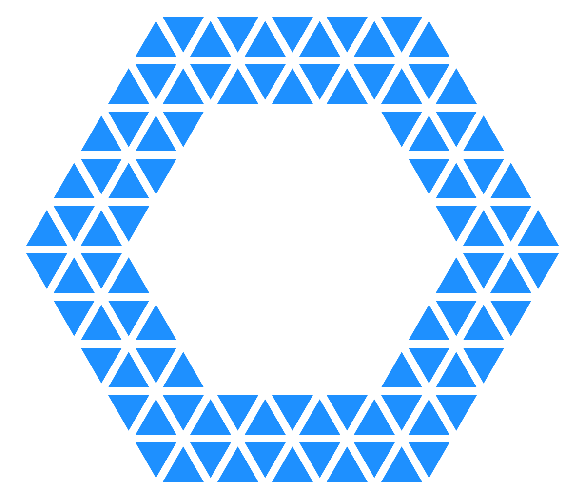

<p align="center">
    
</p>

# OpenAPI-Builder

:herb: OpenAPI GUI Builder [Online](https://googee.github.io/OpenAPI-Builder/dist)


## Feature

### Make a Schema


### Make Path


## Project setup
```
npm install
```

### Compiles and hot-reloads for development
```
npm run serve
```

### Compiles and minifies for production
```
npm run build
```

### Lints and fixes files
```
npm run lint
```

### Customize configuration
See [Configuration Reference](https://cli.vuejs.org/config/).
